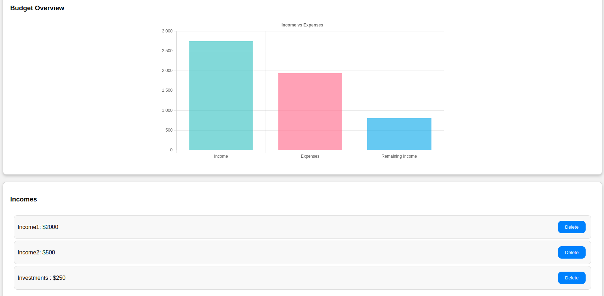
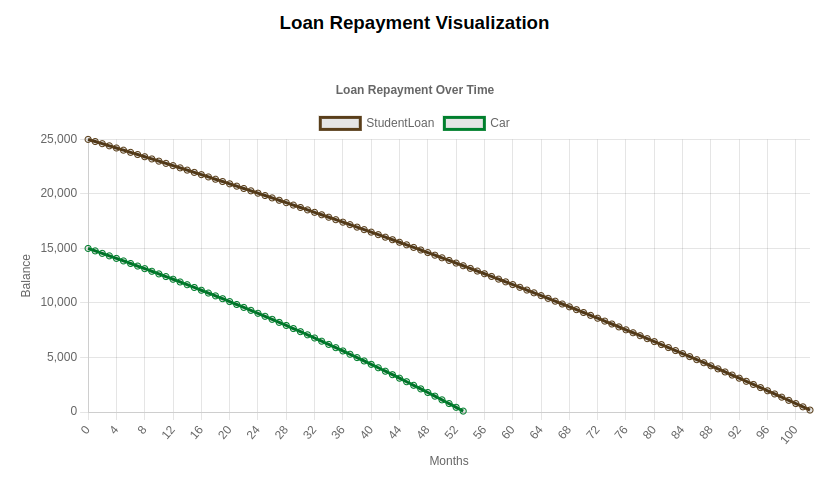
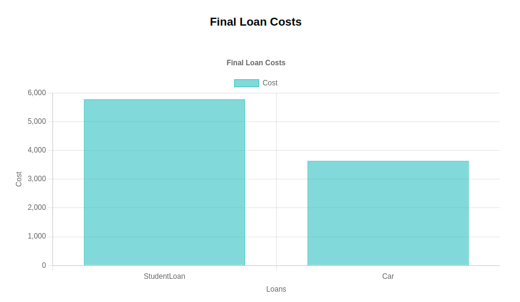
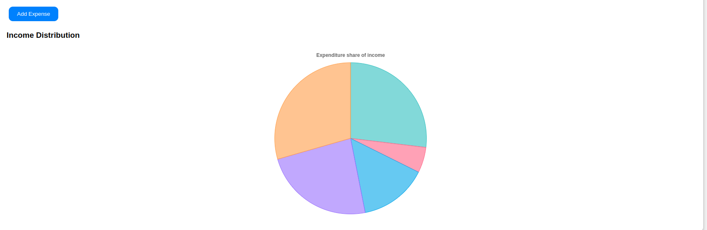

# Budget App

The Budget App is a simple yet effective tool designed to help users manage their finances. It allows users to track their incomes, expenses, and loan statuses while providing insights through easy-to-understand visualizations. This was one of the first apps I built with real utility, and its development process was relatively fast. Although the quick development timeline is evident in some areas, the app successfully fulfills its intended purpose.

## Key Features
Income and Expense Tracking: Keep track of all incomes and expenses in one place.

Loan Management: View loan balances, monthly expenses, and the total cost of loans.

Loan Simulation: Calculate loan prices at different payment rates and analyze repayment plans.

Budget Insights: Visualize budget data with clear, interactive graphs powered by Chart.js.

Tech Stack
Front-End Framework: React
Hosting and Database: Google Firebase
Firebase provides a simple database solution and user authentication, which allowed for rapid implementation without extensive coding.
Visualization Library: Chart.js
No additional libraries were used outside of those provided by Firebase.
Development Insights
This app was built with utility and speed in mind. React was my primary choice for development due to its simplicity and efficiency in building web applications. Hosting the app on Google Firebase proved to be a great decision, as it facilitated a seamless database solution and streamlined user authentication.

### While the app works as intended, there are areas for improvement:

Component Structure: The component hierarchy could be better organized for easier maintenance and scalability.
Backend Integration: Currently, the app lacks a separate backend, making it less scalable. Adding a dedicated backend would significantly enhance its performance and structure.
Code Refinement: Some parts of the codebase are not as modular or clean as they could be, with a few "spaghetti-like" structures that could benefit from refactoring.

#### Lessons Learned
Building this app taught me a lot about front-end development, state management, and integrating third-party tools like Firebase and Chart.js. It also gave me a deeper understanding of rapid development workflows and the trade-offs between speed and scalability.
